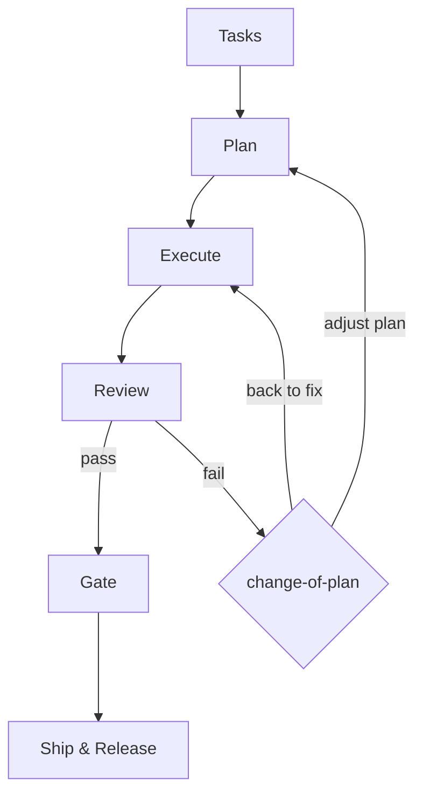

# maeh

a maestro that orchestrates mass of agents.

## Goal

maeh aims to be:

1. an agent orchestration with extreme efficiency. metrics to track: token per day (initial goal: 1K per day except skills and tool load)
2. a self-improving workflow manager, open to changes of paradigms, and opinionated tool for modern SWEs
3. simplest AI coding harness agnostic tooling.

## Principle

maeh tries to achieve following workflow



1. Tasks: this can be either from a tracker (e.g., Linear, Jira, Notion, etc.) or raw natural language. Tasks from trackers are assumed to have its own structure, while natural language lacks enough context by nature. `/maeh-task-to-plan` helps you to fill the context through interview and exploration.
2. Plan: from task definition, plan step compile it into executable plans. Plan is represented as a tree (plan tree). Plan tree serves as a sequence of work that both agents and humans tracks the progress.
3. Execute: each node of plan tree is an executable action, translated into workspace. Workspace is a development environment for both agents and human, consisting of editor, primary, and critic (see definitions below). Each workspace creates an increment that corresponds to a node of plan tree, for example, a PR with enough context description and CI pass, a document in a file system, and an artifact that a task defines. Use `/maeh-plan-to-workspaces` to assign workspaces to appropriate code location.
4. Review: an agent reviews increments individually and as a whole. Use `/maeh-review-the-increments` to follow pre-existing guidelines per repo and custom review guardrails. If review verdict is failure, use `/maeh-change-of-plan` to adjust plan or bring it back to execute to make some fixes.
5. Gate: a human gate that reviews the work holistically. This is enabled by a one-page gate summary, where it specifies context of this specific increments in the context of current plan tree, what to check, what's ask from agents, and what's change agents made in a nutshell. The summary one-pager has to be interactive by nature. Gate reviewer should be able to leave inline comments. Use `/maeh-move-to-gate` to pull this off.
6. Ship & Release: Interact with external world. It can be GH PR creation, change sharing configuration so other people in the team can see, and so forth.

Key terms:

- **Workspace**: a development environment that can vary by backend. Supported backends: tmux and herdr. Made up of an editor, a primary, and a critic.
- **Editor**: the text editor opened in the workspace for the human (`[agents].editor_cmd`).
- **Primary**: an agent instance that does the work. Confers with the critic on its execution, and runs multiple subagents to parallelize tasks — test, cosmetics, documentation, etc.
- **Critic**: an agent instance that critiques the primary's work. Confers with the primary to keep the guardrails and ensure quality of increments.

Following components are to achieve self-improvement of workflow:

- Configs: Default location is `~/.maeh/config.toml` ($MAEH_HOME/config.toml)
- Agents: `~/.maeh/agents/<agent-name>/AGENT.md` serves as a centralized agent instruction location.
- Memory: an external memory layer defined by harness setting. If this is configured, you can look up memory
- Logs (read-only): every CLI invocation is logged in `~/.maeh/logs/<YYYY-MM-DD.log>`. logging config logs plan ID and node ID to pair them
- Metrics (read-only): CLI telemetry logs metrics in JSON to `~/.maeh/metrics/<metric-name>/<YYYY-MM-DD.jsonl>`. This metrics are aggregated with stdlib `json`.
- Retro handoff (read-only): each workflow run emits a short retro handoff note in markdown.
- Past improvement note: a one-paragraph note about past improvement. `~/.maeh/improvements/<YYYY-MM-DD.md>`

`/maeh-improve-the-workflow` uses the source above to find a way to improve next workflow run. Each improvement needs a clear goal with problems to address and evidence of improvement, success criteria. The subsequent improvement should revisit the previous improvement note to validate the change's claim.

## Presentation

maeh consists of two parts in code:

1. CLI with rich TUI
2. Agent skills

### Plan tree

The TUI renders the plan tree live — color-coded status icons, and `Enter` (or click) on a node opens its workspace.

```
◐ redefine maeh
├── ✔ task-to-plan
├── ◐ plan-to-workspaces
│   ├── ✔ spike TUI
│   └── ○ wire backend
├── ○ review-the-increments
└── ✗ move-to-gate

✔ done   ◐ running   ○ todo   ✗ failed
```

## Design principle

1. Simplicity over architectural perfectionism
2. DRY
3. Graphics over lengthy text
