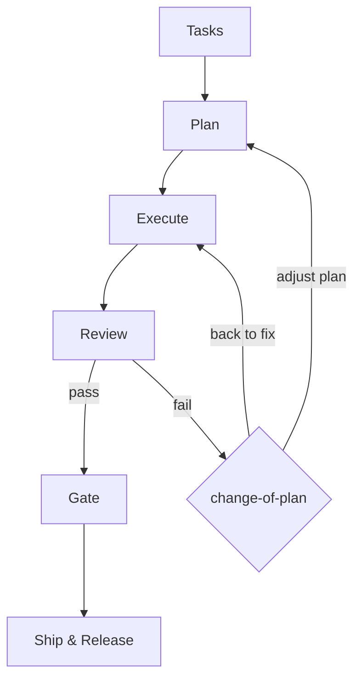

# maeh — Specification

**Status:** design stage (no runnable CLI yet)

## 1. What maeh is

maeh is an agent-orchestration harness for modern SWEs: it turns a task into a
reviewable increment through a fixed six-stage workflow, with a rich terminal UI
and a set of composable agent skills. It is harness-agnostic (works alongside
Claude Code, Cursor, Codex, etc.) and optimized for token efficiency.

## 2. Goals

| # | Goal | Success signal |
|---|------|----------------|
| G1 | Extreme token efficiency | Median run stays under a per-run token budget (see §7); tracked in metrics |
| G2 | Self-improving workflow | `improve-the-workflow` produces a note per run; next run validates the prior claim |
| G3 | Simplest harness-agnostic tooling | Core has no dependency on any specific AI harness; skills are plain markdown |

## 3. Non-goals

- Not a coding agent itself — it orchestrates agents/harnesses, it does not replace them.
- Not a CI system — it triggers/reads CI, it does not run it.
- Not a tracker — it reads tasks from Linear/Jira/Notion, it does not own them.
- No web UI in v1. TUI only.

## 4. Workflow (the six stages)



1. **Tasks** — from a tracker (structured) or raw natural language (needs context). `task-to-plan` fills gaps via interview + exploration.
2. **Plan** — compile task into an executable **plan tree**; each node is one executable action, tracked by both agents and humans.
3. **Execute** — each node maps to a **workspace** (a dev environment per backend). Each workspace emits an **increment** (PR, document, artifact). `plan-to-workspaces` assigns them.
4. **Review** — an agent reviews increments individually and holistically against per-repo guidelines + custom guardrails (`review-the-increments`). On failure, `change-of-plan` adjusts the plan or returns to Execute.
5. **Gate** — a human gate over a one-page interactive summary (`move-to-gate`): context in the plan tree, what to check, asks, changes-in-a-nutshell; supports inline comments.
6. **Ship & Release** — interact with the outside world: open a GH PR, share config, etc.

## 5. Key terms

- **Plan tree** — a tree whose nodes are executable actions; the shared progress artifact. Every node has a stable id (reused for logging and as its workspace handle).
- **Workspace** — a development environment that varies by backend. Supported backend: `tmux`. `herdr` is planned — stub only in v1 (see §10 Q4). Consists of editor, primary, and critic.
- **Editor** — the text editor opened in the workspace for the human (configured by `[agents].editor_cmd`, default `nvim`).
- **Primary** — the agent instance that does the work; confers with the critic and runs subagents to parallelize (test, cosmetics, documentation, …).
- **Critic** — the agent instance that critiques the primary's work; confers with the primary to keep guardrails and ensure increment quality.
- **Increment** — the unit of output a node produces (PR + description + green CI, a file, an artifact).

## 6. Components (self-improvement inputs)

| Component | Location | Mode |
|-----------|----------|------|
| Config | `$MAEH_HOME/config.toml` (default `~/.maeh/config.toml`) | read/write |
| Agents | `~/.maeh/agents/<agent-name>/AGENT.md` | read |
| Memory | external layer defined by harness setting | read (if configured) |
| Logs | `~/.maeh/logs/<YYYY-MM-DD>.jsonl` (structured: ts, level, event, plan id, node id, message) | read-only |
| Metrics | `~/.maeh/metrics/<metric-name>/<YYYY-MM-DD>.jsonl` (aggregated with stdlib `json`) | read-only |
| Retro handoff | one short markdown note per run | read-only |
| Improvement note | `~/.maeh/improvements/<YYYY-MM-DD>.md` (one paragraph) | read-only |

`improve-the-workflow` reads the read-only telemetry sources above (logs,
metrics, retro handoff, improvement notes) to propose the next run's improvement.
Each improvement states a goal, the problem, evidence, and success criteria; the
next improvement revisits the prior note to validate its claim.

## 7. Constraints

- **Language:** Python ≥ 3.11 (stdlib `tomllib`).
- **TUI:** Textual. **CLI/TUI is a presentation layer only** — no business logic. All logic lives in `maeh.core`, which must not import `maeh.cli` or `textual`.
- **CLI conventions:** a global repeatable `--set path.key=value` (Helm-style; coerced and applied inside `core.config`, not the CLI) overrides any config value on demand; `-o/--output {json,yaml,plaintext}` on read commands (`config`, `get`) makes output pipeable into `jq`/`yq`.
- **Skills:** plain markdown (`SKILL.md` + optional `references/`), harness-agnostic.
- **Token budget (G1):** a per-run output-token target recorded in metrics; the initial aspirational figure and its exact definition are TBD and must be pinned before G1 is claimed met.
- **Persistence:** plan-tree state and all component files live under `$MAEH_HOME`; no external DB and no extra deps in v1 — metrics are jsonl aggregated with stdlib `json` (revisit DuckDB only if metric volume warrants it).

## 8. Architecture overview

```
maeh/
  core/     # pure domain + services. No textual, no cli imports.
    models.py       # Node, PlanTree, Status, Increment (dataclasses/enums)
    plan.py         # build/traverse/mutate the plan tree
    config.py       # load + resolve $MAEH_HOME/config.toml
    store.py        # load/save plan-tree state under $MAEH_HOME
    workspace.py    # open_workspace() — tmux (herdr added later behind a protocol)
    telemetry.py    # structured logs + jsonl metrics writer
  cli/      # presentation only. Imports core; core never imports cli.
    main.py         # entrypoint (typer): subcommands delegate to core services
    app.py          # Textual App
    widgets/plan_tree.py  # renders core.PlanTree, emits actions back to core
  skills/   # agent skills (markdown), one dir per stage command
```

**Dependency rule (enforced in tests):** `maeh.core` imports nothing from
`maeh.cli` or `textual`. The CLI/TUI translates user input into core service
calls and renders core return values — it holds no domain logic.

## 9. Skills (v1 set)

One skill per agent-driven step of the workflow. Ship & Release (Stage 6) is
manual by design and has no skill; `improve-the-workflow` is cross-cutting (it
runs after a run, not on a single transition). `task-to-plan` spans Stages 1–2
(it produces the plan tree). Each skill is authored per the skill-development
conventions (third-person description with trigger phrases, imperative body,
progressive disclosure).

| Skill | Purpose |
|-------|---------|
| `task-to-plan` | Interview + explore to turn a task into a plan tree |
| `plan-to-workspaces` | Assign plan-tree nodes to workspaces/code locations |
| `review-the-increments` | Review increments vs guidelines + guardrails |
| `change-of-plan` | Adjust the plan tree on review failure |
| `move-to-gate` | Produce the interactive one-page gate summary |
| `improve-the-workflow` | Propose the next run's improvement from telemetry |

## 10. Security & data handling

maeh ingests untrusted input (tracker items, repo and memory content) and spawns
agents that act with real privileges, so these are design invariants, not
add-ons.

**Implemented in v1:**
- **Identifier safety** — node ids, plan ids, and metric names are validated
  (`require_safe_segment`: `^[A-Za-z0-9](?:[A-Za-z0-9._-]*[A-Za-z0-9])?$`) at the
  model/store boundary before use in any path or subprocess argument. Blocks path
  traversal (`load_plan`, `emit_metric`) and tmux argument injection.
- **Injection hardening** — node names are Rich-escaped before TUI rendering; log
  messages have newlines stripped so the `plan_id node_id message` line stays
  parseable.
- **Atomic state** — `save_plan` writes to a temp file + `os.replace` so a crash
  never corrupts the plan JSON.
- **Single writer** — every plan mutation goes through `store.update_plan`, which
  holds an exclusive per-plan `flock`, so concurrent primary/critic can't lose
  each other's updates.
- **Data at rest** — `$MAEH_HOME` and its subdirs are created `0700` and all
  content files (`plans/`, `logs/`, `metrics/`) written `0600` via `fsutil`.

**Required before real agents run (not yet built):**
- **Untrusted input is data, never instructions** — tracker/repo/memory content
  must be delimited/quoted in agent prompts and never interpreted as directives.
- **Least privilege** — primary/critic run with per-workspace credentials, not
  the operator's ambient environment; the critic is an independent gate that the
  primary cannot steer.
- **Secrets** — no secrets in `config.toml` or code; use env/OS-keyring/federated
  identity. Ship & Release must scrub/allowlist config keys before sharing.
- **Redaction** — scrub secrets/PII on the write path for logs, metrics, retro
  notes, and gate summaries; `move-to-gate` links to diffs rather than pasting.

## 11. Open questions

1. Exact token-budget metric definition and value (blocks G1). Unit is **per run**
   (§2, §7); the initial figure is aspirational until pinned.
2. How the gate one-pager achieves interactivity + inline comments in a TUI (TUI pane? exported HTML? PR-backed?).
3. Memory layer contract — schema and lookup API.
4. `herdr` backend interface details. Adding it introduces a `WorkspaceBackend`
   protocol + dispatch; until then `open_workspace` is tmux-only.
5. Retention/erasure policy for `$MAEH_HOME` logs, metrics, plans, and notes.
